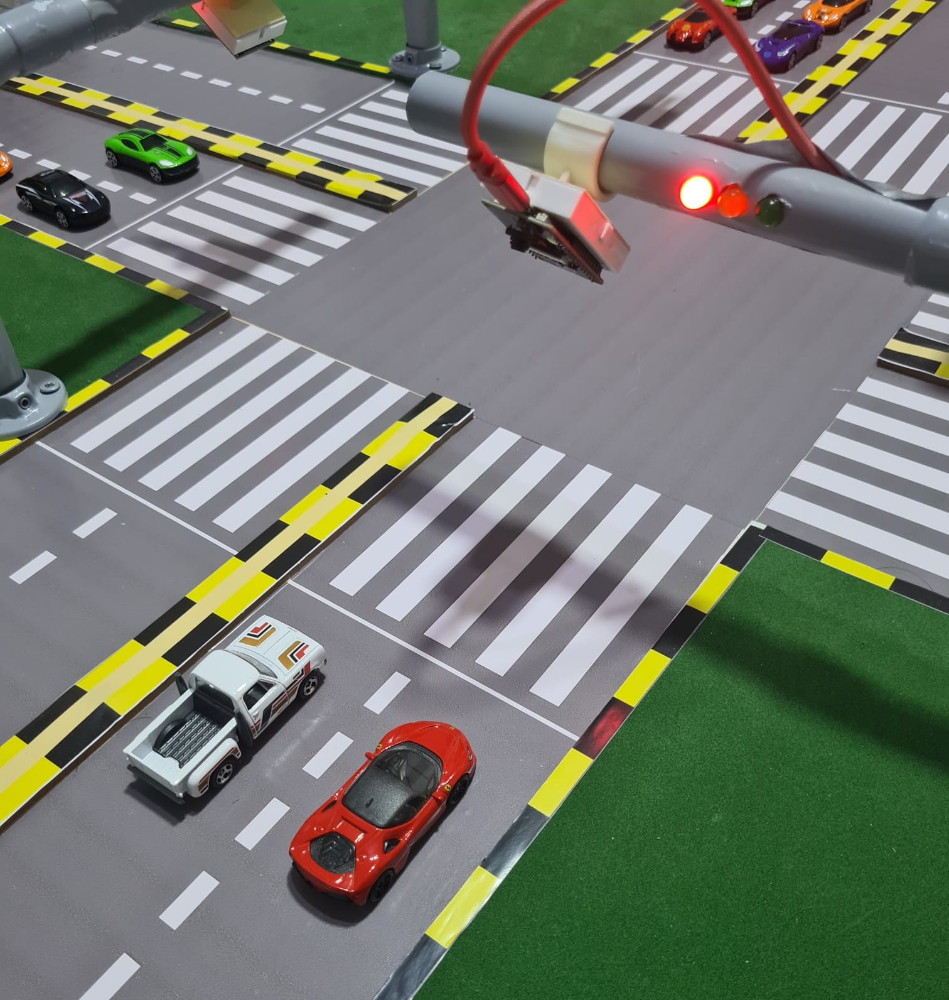
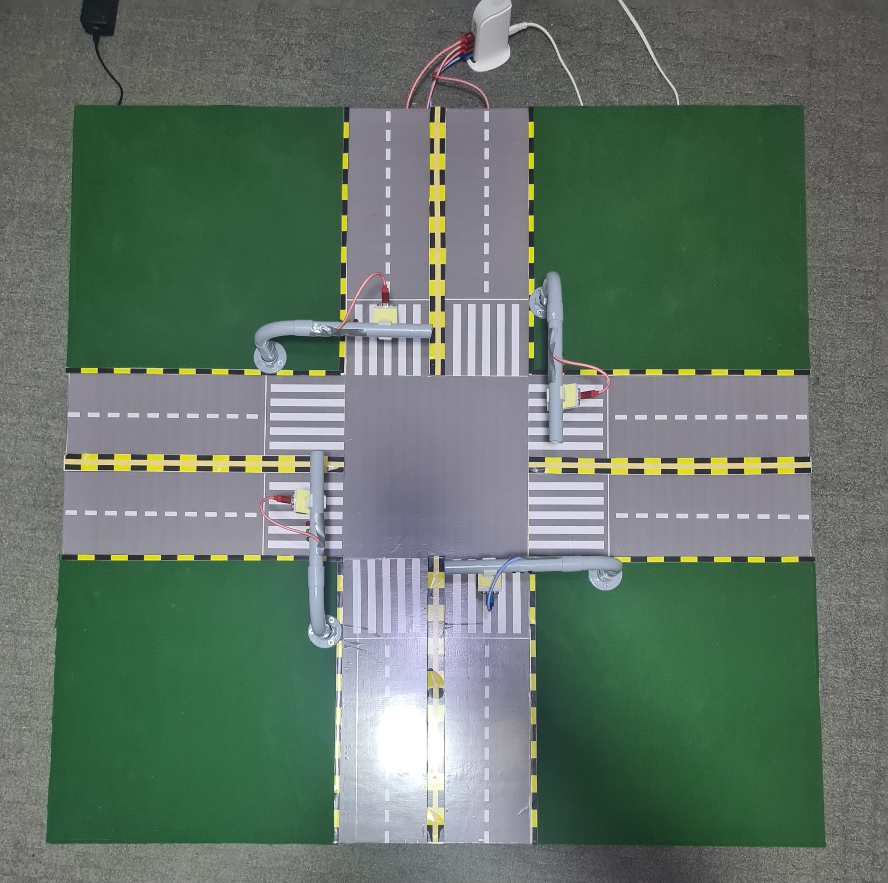
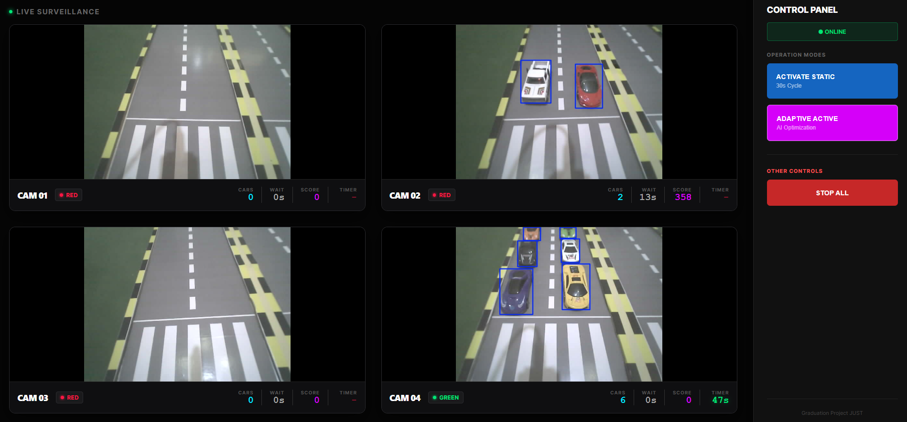
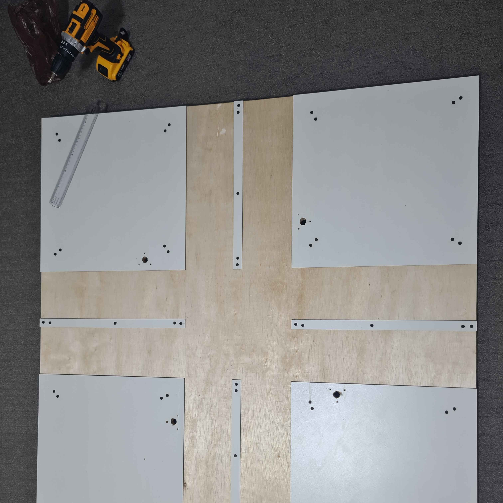
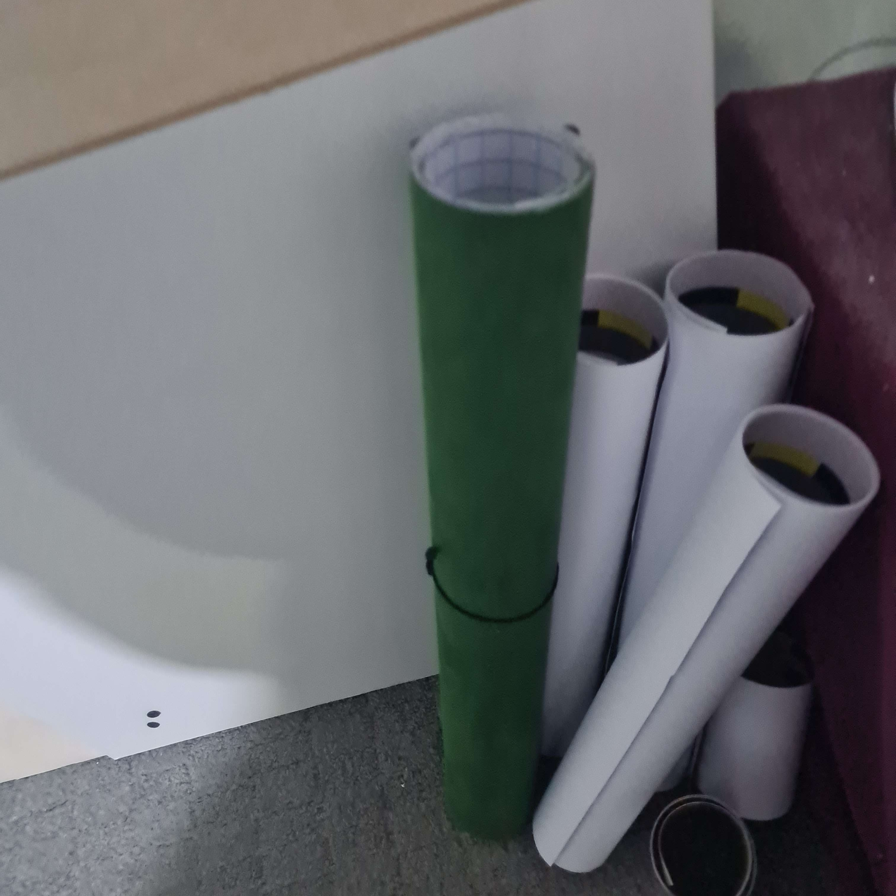
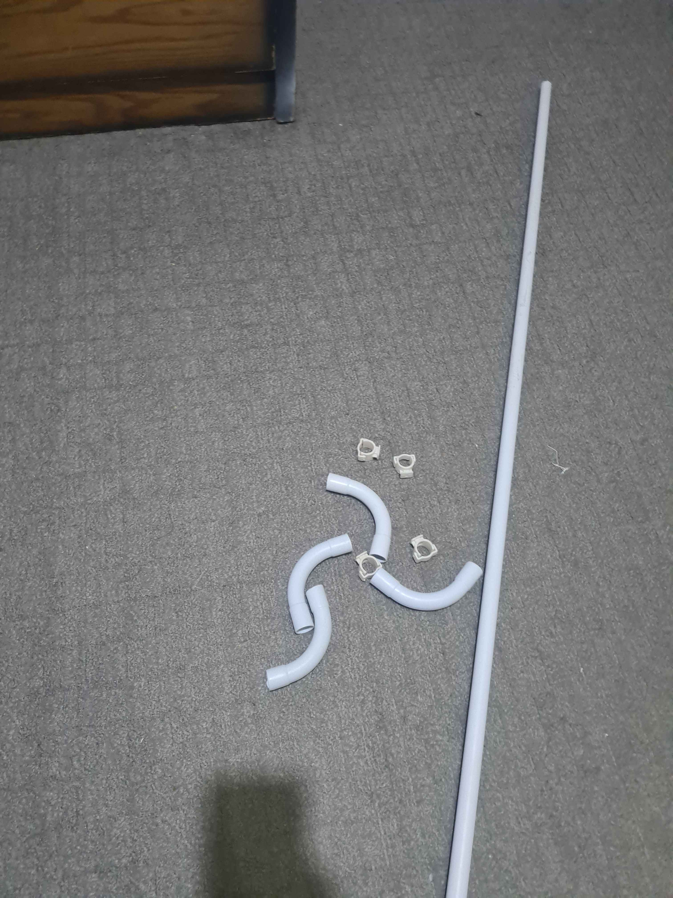
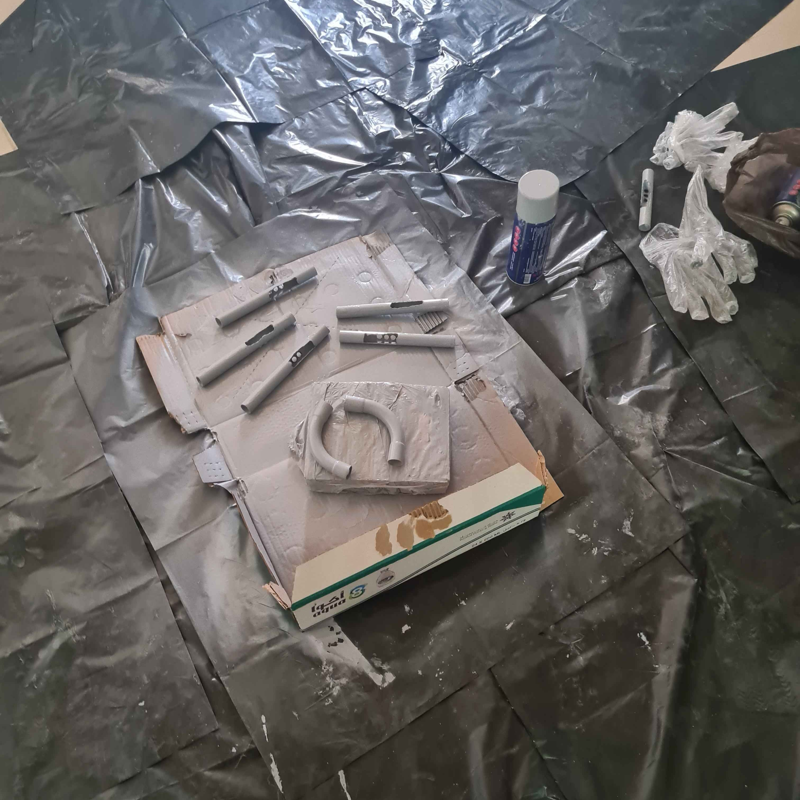
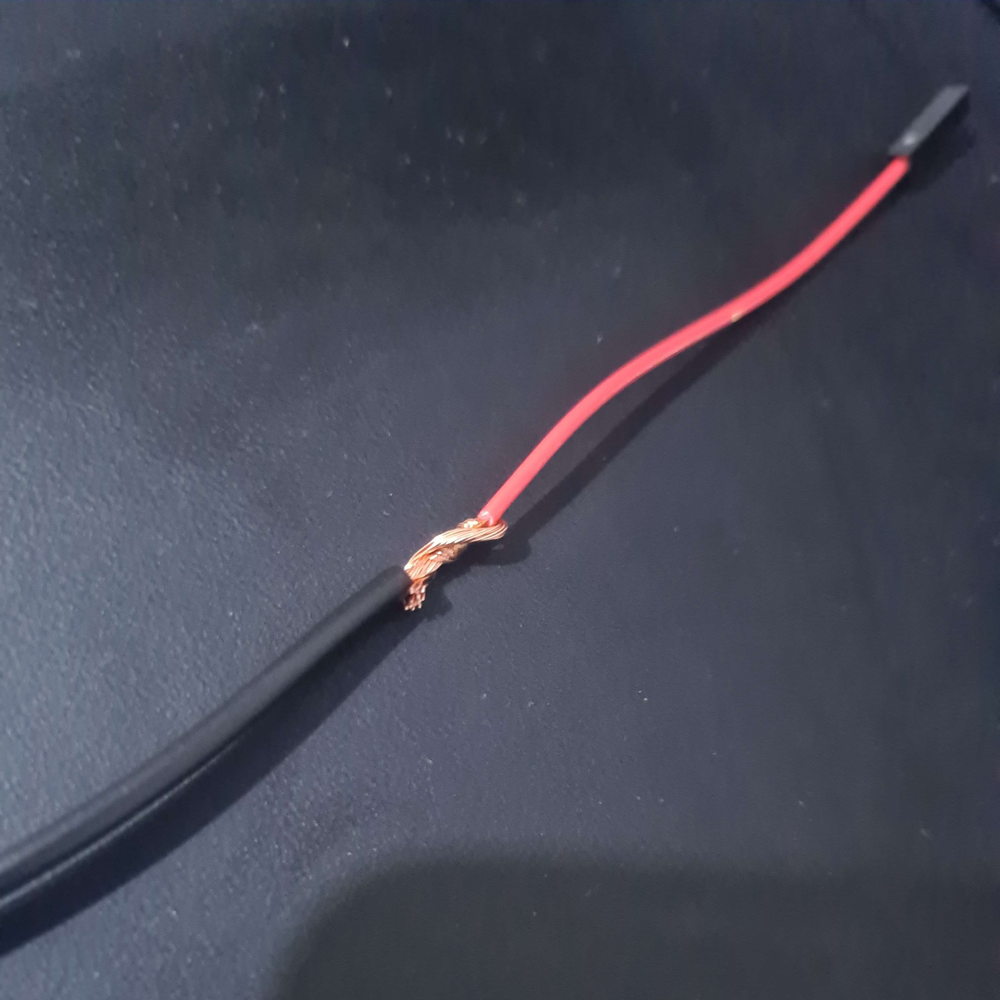
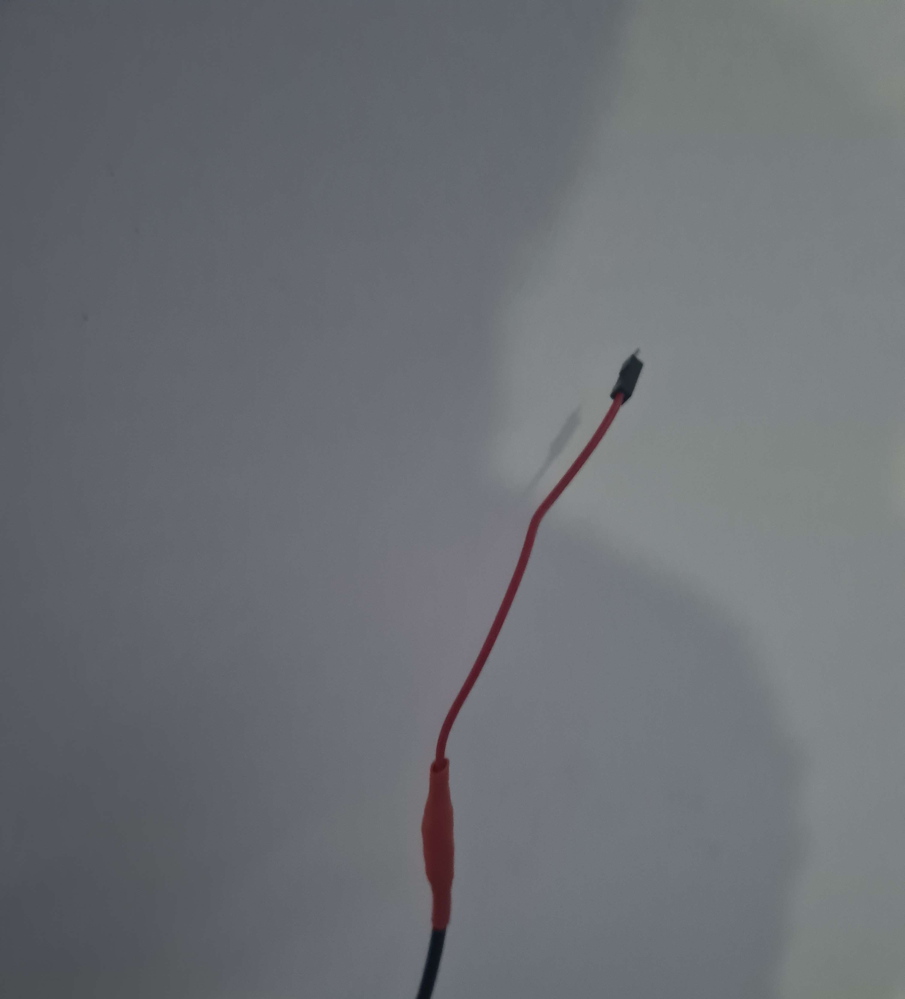
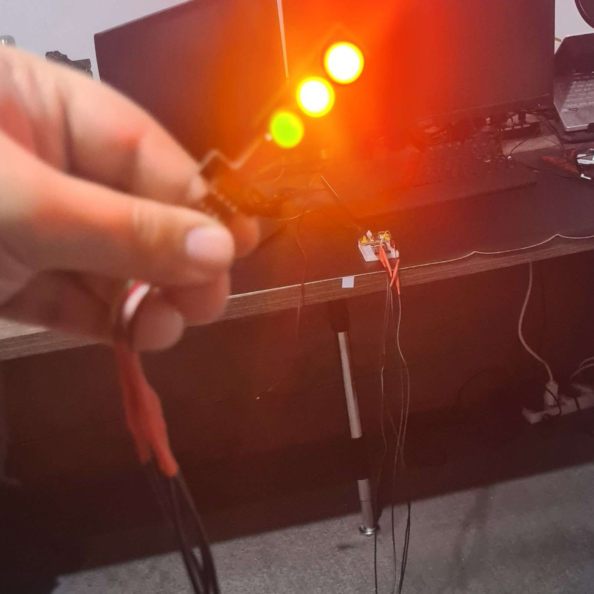

# Smart Traffic Management System Using IoT and AI Technology

This repository contains the graduation project developed for the Network Engineering and Security Department at Jordan University of Science and Technology (Fall 2026).

 

### Watch the video demonstration here [(Demonstration Video)](https://drive.google.com/file/d/10BsdG9Q_iznuHvMeiyBu6FtfrUq_AhGE/view?usp=drive_link)

 

 &nbsp; 

---

## Project Overview

Current traffic lights operate on pre-set timers (fixed-time inefficiency), ignoring real-time traffic load, which leads to high latency at intersections and critical delays for emergency responders. 

Our proposed system is a cost-effective, easily deployable Smart Traffic Management System that utilizes Computer Vision (YOLOv8), IoT infrastructure, and a Dynamic Algorithm to minimize wait times, maximize intersection throughput, and prioritize emergency vehicles.

## Key Features & Objectives
* **AI Vehicle Detection:** High-accuracy real-time vehicle counting and emergency vehicle recognition using YOLOv8.
* **IoT Connectivity:** Seamless wireless communication between edge/cloud computing, ESP32-CAMs, and Arduino controllers.
* **Algorithm Flexibility:** The system is completely algorithm-agnostic. It is built to seamlessly plug in and apply **any custom control algorithm** to optimize traffic flow.
* **Emergency Vehicle Priority:** Built-in priority mechanisms for ambulances and fire trucks to prevent critical response time failures while maintaining regular traffic flow.
* **Cost-Effective & Scalable:** Replaces expensive wired sensors and heavy construction with cheap wireless cameras and simple microcontrollers, making it ideal for historic and established cities.

## Scientific Foundation & Control Logic
The system abandons static timing in favor of dynamic optimization algorithms to guarantee mathematical stability during peak traffic hours. Because of its flexible design, any mathematical model can be tested and applied. 

As our primary tested control logic, we implemented a Max-Pressure algorithm that calculates a pressure score for each road using the following formula:

**`P = Q × W²`**
* **P (Pressure Score):** The calculated priority for the road.
* **Q (Queue Length):** Number of vehicles detected by the YOLOv8 AI.
* **W (Wait Time):** Total time since the road last had a green light.

## AI Model Training

  
  

To achieve accurate vehicle detection and classification, the AI model was trained using a custom dataset prepared through Roboflow. Images were collected from multiple angles and under varying lighting conditions and backgrounds. Each image was carefully annotated to distinguish between regular vehicles and emergency vehicles. The model was trained to accurately recognize and classify vehicles, as well as count them in real time, ensuring reliable performance.

## System Architecture

The hardware and software seamlessly communicate to control the intersection:
1. ESP32-CAM captures and streams intersection video.
2. Network Gateway routes the stream to the Cloud Computing/Edge environment.
3. The server runs AI inferences (YOLOv8) and the applied Control Algorithm.
4. Control commands are forwarded via the Gateway to an Arduino UNO R4 WiFi.
5. The Arduino executes the light switches on the Traffic Light Module and returns status confirmations.

## Web Dashboard & Live Surveillance

To monitor and manage the intersection in real time, a centralized web dashboard was developed. The control panel provides:
* **Live Video Feeds:** Displays real-time streams from all four intersection cameras (CAM 01 - CAM 04) showing active YOLOv8 object detection bounding boxes.
* **Real-Time Metrics:** Continuously updates the active car count, wait time, and calculated pressure score for each lane.
* **Signal Status:** Shows the current state of the traffic lights.
* **Emergency Controls:** Features a "STOP ALL" manual override button for immediate intersection halting during critical situations.

## Physical Prototype & Hardware Development
To demonstrate the system in a real-world scenario, a physical scale model was built. This development process involved custom structural work and hardware integration:

<table align="center">
  <tr>
    <td align="center" width="33%">
       
      <b>Base Construction:</b> Preparing the wooden intersection board.
    </td>
    <td align="center" width="33%">
       
      <b>Road Design:</b> Vinyl rolls for road textures and lane markings.
    </td>
    <td align="center" width="33%">
       
      <b>Structural Framework:</b> Cutting PVC conduits for traffic light poles.
    </td>
  </tr>
  <tr>
    <td align="center">
       
      <b>Finishing:</b> Painting the PVC infrastructure for a realistic look.
    </td>
    <td align="center">
       
      <b>Electronics:</b> Custom wire splicing for component connectivity.
    </td>
    <td align="center">
       
      <b>Insulation:</b> Applying heat shrink tubing to secure wire connections.
    </td>
  </tr>
  <tr>
    <td align="center">
       
      <b>Component Testing:</b> Testing LED traffic modules prior to assembly.
    </td>
    <td align="center">
       
      <b>Final Assembly:</b> Top-down view of the fully assembled physical prototype.
    </td>
    <td align="center">
       
      <b>Hardware Integration:</b> Complete setup with sensors, lights, and scale vehicles.
    </td>
  </tr>
</table>

* **Structure:** The intersection was built on a wooden base using a drill for secure mounting.
* **Poles & Gantries:** Custom-cut PVC pipes and joints were used to create the supports for the traffic light modules and ESP32 cameras.
* **Wiring:** Hand-spliced and soldered wires were used to connect the central Arduino to the various traffic light signals across the board.

## Simulation & Results

Before physical prototyping, the system was extensively benchmarked against static baselines using SUMO (Simulation of Urban Mobility) and the LuST (Luxembourg SUMO Traffic) real-world dataset via a TraCI Python controller interface.

**Performance Improvements:**
* **Average Delay:** Reduced by approximately 50% compared to traditional fixed-time systems.
* **Average Travel Time:** Decreased from 779 seconds to 638 seconds.
* **Throughput:** Achieved higher capacity, keeping the intersection stable even under heavy load.

## Future Work
* **Relay-Based Switching Model:** Integrating relays to seamlessly fail over between smart AI control and normal fixed-time control if the network drops.
* **Ultrasonic Sensors:** Adding hardware fallbacks to detect if a camera lens is blocked or obscured.
* **Advanced Emergency Signaling:** Deploying dedicated smart signals that safely guide emergency vehicles through intersections while optimizing the clearing of civilian traffic.

## Team Members
* Khaled Abdalnasser Aldabet
* Mohammad Iyad Shatarah
* Amine Feras Kiwan
* Saleh Mohammad Talafha

---
*Developed as a graduation project at Jordan University of Science and Technology (JUST).*
